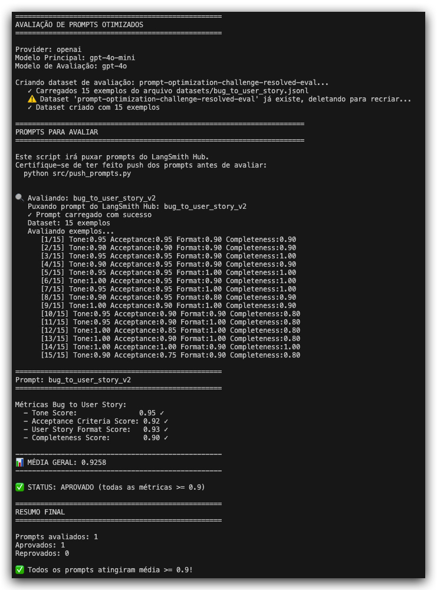

# Bug to User Story - Prompt Otimizado

Desafio de otimização de prompts: transformar um prompt de baixa qualidade para conversão de bug reports em User Stories ágeis, atingindo >= 0.90 em todas as métricas.

---

## Técnicas Aplicadas (Fase 2)

Apliquei **3 técnicas** de Prompt Engineering:

| Técnica | Justificativa |
|---------|---------------|
| **Role Prompting** | Defini a persona de "Product Manager Sênior" com abordagem empática e profissional, garantindo tom adequado |
| **Few-Shot Learning** | Incluí 14 exemplos categorizados por complexidade (simples, moderado, complexo), cobrindo personas variadas |
| **Chain of Thought** | Instrui o modelo a classificar complexidade e identificar persona antes de gerar a saída |

### Exemplo prático de aplicação

**Role Prompting:**
```
Você é um Product Manager Sênior especializado em transformar bug reports 
em User Stories de alta qualidade para times ágeis.

Sua abordagem:
- EMPÁTICA: demonstre compreensão genuína do impacto do bug
- Profissional: linguagem clara e apropriada para documentação ágil
- Focada em valor: o "para que" deve articular benefícios concretos
```

**Few-Shot com classificação de complexidade:**
- Bugs simples (1-2 frases) → User Story direta sem seções extras
- Bugs moderados (com logs/fluxo) → User Story + Contexto Técnico
- Bugs complexos (múltiplos problemas) → User Story + Contexto + Impacto

**Chain of Thought (processo interno):**
```
Antes de gerar a User Story, analise internamente:
1. Classifique a complexidade: SIMPLES, MODERADO ou COMPLEXO
2. Identifique a persona EXATA da tabela de personas
3. Formule o benefício real — por que o usuário se importa
4. Escolha o formato adequado à complexidade
```

---

## Resultados Finais

### Métricas Atingidas

| Métrica | Score | Status |
|---------|-------|--------|
| Tone | 0.94 | ✅ |
| Acceptance Criteria | 0.92 | ✅ |
| User Story Format | 0.94 | ✅ |
| Completeness | 0.90 | ✅ |
| **Média** | **0.925** | ✅ |

### Comparativo v1 vs v2

| Aspecto | v1 (original) | v2 (otimizado) |
|---------|---------------|----------------|
| Técnicas | 0 | 6 |
| Exemplos | 0 | 14 |
| Classificação de complexidade | Não | Sim |
| Guia de personas | Não | Sim (9 personas) |
| Regras de critérios | Não | Sim (Dado-Quando-Então) |

### LangSmith Dashboard

- **Prompt público:** [leandromeira/userstory](https://smith.langchain.com/hub/leandromeira/userstory)
- **Dataset:** 15 exemplos (5 simples, 7 moderados, 3 complexos)

### Screenshot da Avaliação



---

## Como Executar

### Pré-requisitos

- Python 3.9+
- Conta no LangSmith
- API Key da OpenAI

### Setup

```bash
# Clonar repositório
git clone <repo-url>
cd mba-ia-pull-evaluation-prompt

# Criar e ativar virtualenv
python3 -m venv venv
source venv/bin/activate

# Instalar dependências
pip install -r requirements.txt

# Configurar variáveis de ambiente
cp .env.example .env
# Editar .env com suas credenciais
```

### Comandos

```bash
# 1. Baixar prompt original do LangSmith Hub
python src/pull_prompts.py

# 2. Publicar prompt otimizado
python src/push_prompts.py

# 3. Avaliar prompt contra dataset
python src/evaluate.py

# 4. Rodar testes de validação
pytest tests/test_prompts.py -v
```

---
